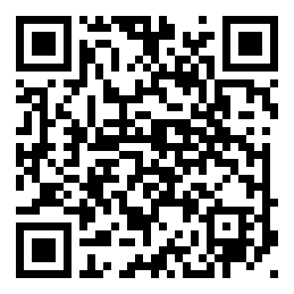

# Estación meteorológica
Aplicación desarrollada para la materia IoT de la Licenciatura en Sistemas de la Universidad Nacional de Río Negro, Argentina. Cursada 2016.

## Índice
1. [Autores](#autores).
2. [Docuentes](#docentes).
3. [Dashboard](#dashboard).
4. [Documentación](#documentacion).
5. [Estructura](#estructura).

## Autores
- Luciano Graziani @ <lgraziani@unrn.edu.ar>.
- Emanuel Sanhueza @ <msanhueza@unrn.edu.ar>.

## Docentes
- Juan Cruz Martínez Luquez @ <jcmluquez@unrn.edu.ar>.
- Guillermo Malpeli @ <gmalpeli@unrn.edu.ar>.

## Dashboard
- Para acceder al panel de control del servidor desde una PC, haz clic aquí: https://app.ubidots.com/ubi/insights/#/list.
- Para acceder desde un celular, escanea el siguiente código QR:

- El usuario y la contraseña son: `iot.2016.unrn`.

**Warning!** The above account is merely educational, and doesn't have any kind of *sensitive* data. Please, don't try to change the password, or break anything, since the mail account it cannot be changed, we can get it back if someone with bad intentions change the password.

## Documentacion
Para el desarrollo de esta aplicación, se utilizaron las siguientes herramientas:

- [Atom](https://atom.io/): como IDE.
- [ArduinoIDE](https://www.arduino.cc/en/Main/Software): para deployar el código en la placa Arduino.
- [Ubidots](http://ubidots.com/): plataforma para almacenar datos de IoT, mostrarlos, recibir notificaciones e interactuar con botones.

A su vez, se utilizaron las siguientes librerías externas:

- [Cactuis IO DHT22](http://static.cactus.io/downloads/library/dht22/cactus_io_DHT22.zip): para el manejo del sensor de temperatura y humedad.
- [VirtualWire](http://www.airspayce.com/mikem/arduino/VirtualWire/): para el funcionamiento de los dispositivos de Radio Frecuencia.
- [Ubidots Arduino Ethernet](https://github.com/ubidots/ubidots-arduino-ethernet/archive/master.zip): para la comunicación entre la estación madre y el servidor de datos.

## Estructura
En este prototipo implementamos dos tipos de arduino.

1. El Arduino Mega se divide en tres partes. La primera, integrada a la placa, es el shield Ethernet que permite la conexión a la red y la comunicación con el servidor. Las otras dos partes se componen de todos los sensores, pudiendo diferenciarlas por su nivel de voltaje (5V y 3.3V). Además tiene un emisor de RF para enviar órdenes al otro Arduino.
2. El Arduino Leonardo actúa como receptor del anterior, y está compuesto por un actuador simulado con un LED y por un receptor de RF.

La comunicación entre Arduinos es unidireccional. En la cual el Arduino Mega le envía un "0" o un "1", según el estado del botón que se encuentra en el panel del servidor, y sirve para simular la apertura y clausura de una compuerta de riego.
